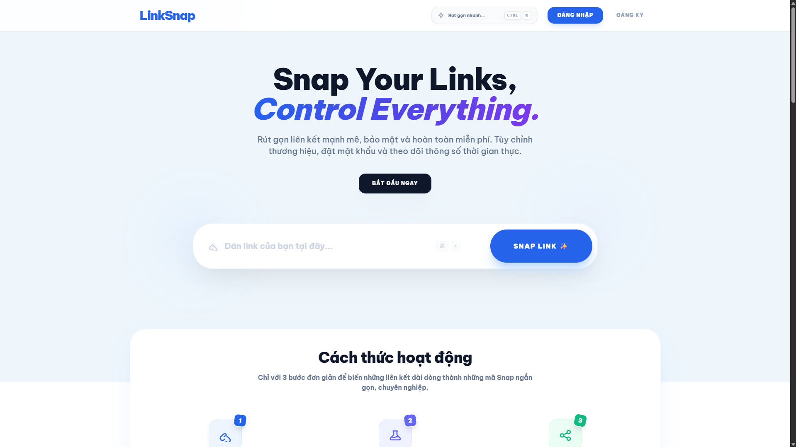

# LinkSnap - URL Shortener & Analytics

LinkSnap là công cụ rút gọn liên kết hiện đại, được xây dựng nhằm mục đích giúp người dùng dễ dàng quản lý, bảo mật và theo dõi hiệu năng của các liên kết trực tuyến. Hệ thống cung cấp các bộ công cụ phân tích dữ liệu chuyên sâu và các tùy chọn bảo mật nâng cao cho liên kết.




## 🛠 Tech Stack

Dự án được phát triển dựa trên các công nghệ mới nhất:
- **Backend**: Laravel 13 (PHP 8.3+)
- **Frontend**: Tailwind CSS v4, Vite, Vanilla JavaScript
- **Database**: MySQL
- **Charts**: Chart.js (Theo dõi dữ liệu trực quan)
- **Integrations**: QR Server API (Tích hợp tạo mã QR)

## ✨ Các tính năng nổi bật

Dự án cung cấp một hệ sinh thái quản lý liên kết toàn diện, từ việc rút gọn đơn giản đến các công cụ phân tích dữ liệu chuyên sâu:

### 🔗 Giải pháp Rút gọn Thông minh
*   **Chuyển đổi tức thì**: Rút gọn URL chỉ với một cú click, tạo mã định danh ngắn gọn (6 ký tự).
*   **Custom Snippets**: Tùy chỉnh mã rút gọn theo thương hiệu hoặc sở thích cá nhân (Dành cho Member).
*   **Branding Control**: Thiết lập Tiêu đề và Mô tả riêng để cá nhân hóa liên kết khi chia sẻ.

### 🛡️ Bảo mật & Kiểm soát Tuyệt đối
*   **Bảo vệ bằng mật khẩu**: Kiểm soát quyền truy cập, chỉ những người có mật khẩu mới có thể xem nội dung gốc.
*   **Hạn dùng linh hoạt**: Thiết lập thời gian hết hạn tự động cho link, giúp quản lý các chiến dịch ngắn hạn.
*   **Giới hạn truy cập**: Tự động khóa liên kết sau khi đạt đủ số lượt click mong muốn.
*   **Quản lý trạng thái**: Bật hoặc tạm dừng hoạt động của liên kết bất cứ lúc nào.

### 📊 Phân tích & Thống kê Chuyên sâu
*   **Dashboard trực quan**: Theo dõi biểu đồ tăng trưởng lượt tương tác trong 14 ngày gần nhất.
*   **User Insights**: Phân tích chi tiết Hệ điều hành, Trình duyệt và thiết bị của người truy cập.
*   **Tracking Logs**: Ghi lại chi tiết IP, User Agent và dòng thời gian thực cho mỗi lần click.
*   **Unique Reach**: Hệ thống tự động phân biệt tổng lượt click và lượt khách truy cập thực tế (Unique Visitors).

### 🎁 Tiện ích Nâng cao
*   **Mã QR Generator**: Tự động tạo mã QR chất lượng cao cho mỗi link, hỗ trợ tải về để sử dụng trên các ấn phẩm truyền thông.
*   **Social Preview**: Tùy chọn Thumbnail và Metadata giúp liên kết hiển thị bắt mắt trên Facebook, Zalo, Telegram.
*   **Universal Management**: Công cụ tìm kiếm mạnh mẽ, hỗ trợ sửa URL gốc, xóa link hoặc làm sạch dữ liệu thống kê (Reset stats).


## 🚀 Hướng dẫn cài đặt

Để chạy dự án LinkSnap trên môi trường local, hãy thực hiện theo các bước sau:

1. **Clone dự án:**
   ```bash
   git clone https://github.com/DuyPhatpeo/rutgonlink.git
   cd rutgonlink
   ```

2. **Cài đặt các thư viện: (Backend & Frontend)**
   ```bash
   composer install
   npm install
   ```

3. **Cấu hình môi trường:**
   - Tạo file `.env` từ file mẫu: `cp .env.example .env` (hoặc copy thủ công trên Windows).
   - Cập nhật thông tin kết nối **MySQL** trong file `.env`.
   - Tạo Key cho ứng dụng: `php artisan key:generate`.

4. **Khởi tạo Database:**
   ```bash
   php artisan migrate
   ```

5. **Chạy ứng dụng:**
   - Chạy đồng thời Server và Vite (Frontend):
     ```bash
     npm run dev
     ```
   - Hoặc chạy lẻ: `php artisan serve` và `npm run dev`.

---
*Dự án được phát triển bởi **Trần Duy Phát***
